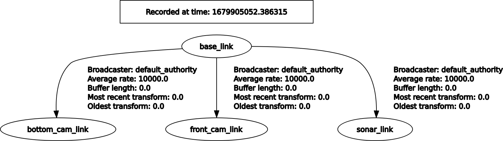

# drone_description

This package contains the xacro/urdf/sdf model description of the sjtu drone and the corresponding plugin for Gazebo 11 and ROS 2 Humble.

## Structure

- **models**: Gazebo sdf model and model meshes
- **include**: Header files for the PID controller and drone plugin
- **src**: Source code for the drone plugin and PID controller
- **urdf**: Xacro and urdf model description files
- **worlds**: Contains one playground world

## Worlds

To fully load the world you need to donwload the gazebo models first:

```
curl -L https://github.com/osrf/gazebo_models/archive/refs/heads/master.zip -o /tmp/gazebo_models.zip \
    && unzip /tmp/gazebo_models.zip -d /tmp && mkdir -p ~/.gazebo/models/ && mv /tmp/gazebo_models-master/* ~/.gazebo/models/ \
    && rm -r /tmp/gazebo_models.zip
```

## TF Tree


